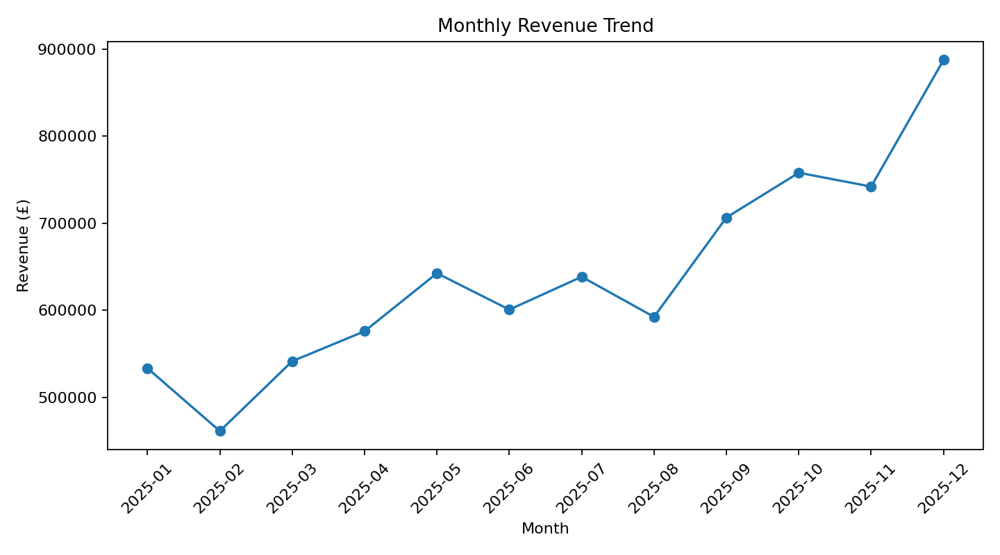
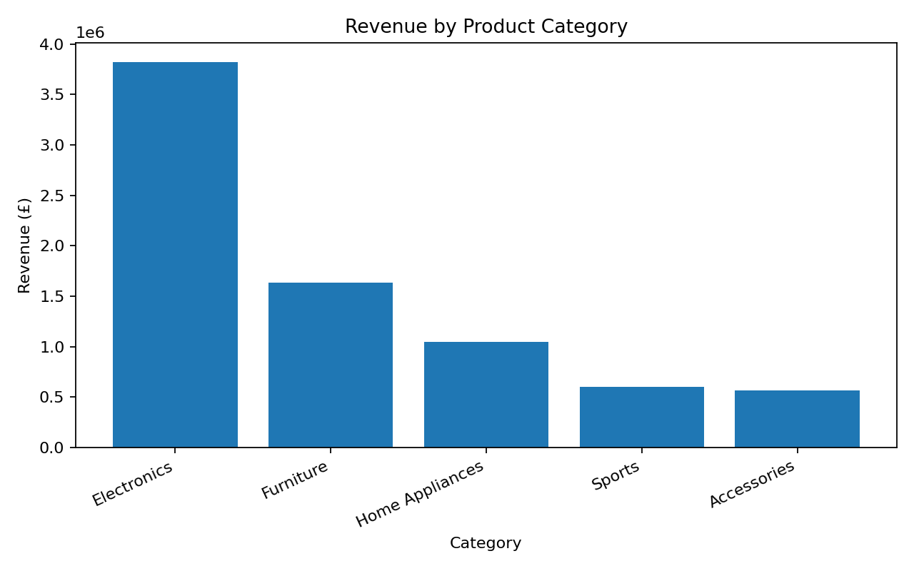
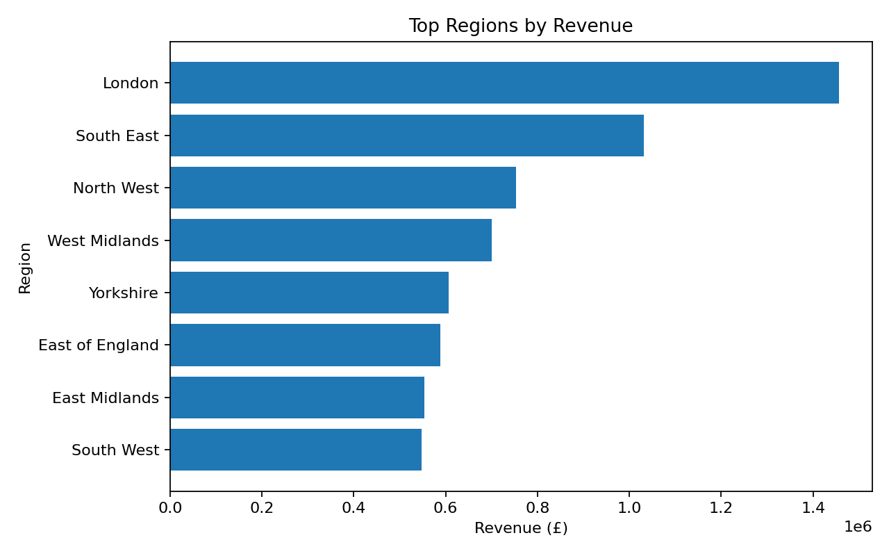

# UK Retail Sales Analytics

 **Data Analyst project** using Python, SQL and Power BI concepts to analyse retail sales performance across products, customer segments and UK regions.

## Project objective

The fictional retail management team wants to understand:

- overall revenue and profitability;
- monthly and seasonal sales patterns;
- best-performing categories and products;
- regional performance;
- customer-segment value;
- the effect of discounting on margin.

## Tech stack

- Python
- pandas / NumPy
- Matplotlib
- MySQL-style SQL
- Power BI
- Pytest
- GitHub Actions

## Executive KPI snapshot

| KPI | Result |
|---|---:|
| Revenue | £7,679,530.47 |
| Profit | £2,625,729.03 |
| Orders | 20,000 |
| Customers | 1,000 |
| Average Order Value | £383.98 |
| Profit Margin | 34.19% |

## Key findings

- **2025-12** generated the highest monthly revenue in the synthetic dataset.
- **Electronics** was the highest-revenue category at approximately **£3,822,409**.
- **London** was the highest-revenue region at approximately **£1,456,081**.
- **Laptop Pro 14** was the highest-revenue product at approximately **£1,383,176**.
- **100.0%** of customers placed more than one order.
- The dataset intentionally applies stronger discounting and demand in November/December, making it possible to analyse the trade-off between seasonal revenue growth and margin.

These results are **demonstrations of analytical methods on synthetic data**, not estimates of the real UK retail market.

## Visual analysis

### Monthly revenue


### Category performance


### Regional performance


## Repository structure

```text
uk-retail-sales-analysis/
├── .github/workflows/tests.yml
├── dashboard/
│   ├── POWER_BI_BUILD_GUIDE.md
│   └── dax_measures.txt
├── data/
│   ├── raw/retail_sales.csv
│   └── processed/retail_sales_clean.csv
├── images/
├── notebooks/
│   └── 01_retail_sales_analysis.ipynb
├── sql/
│   ├── schema.sql
│   └── analysis_queries.sql
├── src/
│   ├── generate_data.py
│   ├── clean_data.py
│   └── analysis.py
├── tests/
│   └── test_data_quality.py
├── .gitignore
├── LICENSE
├── README.md
└── requirements.txt
```

## Data-quality workflow

The raw dataset intentionally contains a small number of:

- duplicated Order IDs;
- missing city values;
- missing payment methods;
- trailing whitespace in selected customer names.

The cleaning pipeline:

1. standardises text fields;
2. fills non-critical missing categorical values with `Unknown`;
3. parses dates and numeric fields;
4. removes duplicate Order IDs;
5. validates positive quantity and price fields;
6. creates year, month, quarter and profit-margin features.

## Run locally

### 1. Clone the repository

```bash
git clone <your-github-repository-url>
cd uk-retail-sales-analysis
```

### 2. Create a virtual environment

```bash
python -m venv .venv
```

Activate it on Windows:

```bash
.venv\Scripts\activate
```

Activate it on macOS/Linux:

```bash
source .venv/bin/activate
```

### 3. Install dependencies

```bash
pip install -r requirements.txt
```

### 4. Regenerate the synthetic dataset

```bash
python src/generate_data.py
```

### 5. Clean the data

```bash
python src/clean_data.py
```

### 6. Run the analysis

```bash
python src/analysis.py
```

### 7. Run tests

```bash
pytest -q
```

## SQL analysis

`sql/analysis_queries.sql` includes:

- executive KPIs;
- monthly trends;
- month-over-month growth using `LAG`;
- category and regional analysis;
- top products;
- customer lifetime value;
- repeat-customer rate;
- discount analysis;
- product ranking using `DENSE_RANK`.

## Power BI

Use `data/processed/retail_sales_clean.csv`.

The `dashboard/` folder contains:

- suggested dashboard layout;
- KPI definitions;
- DAX measures;
- slicer recommendations.

## Business recommendations

- Plan inventory and campaigns around seasonal demand peaks.
- Evaluate discounting based on both revenue lift and margin impact.
- Protect availability of high-value products and categories.
- Compare regions using profit and AOV, not revenue alone.
- Use revenue per customer to identify valuable segments for retention activity.

## Future improvements

- Star-schema data model
- Date dimension
- RFM customer segmentation
- Cohort retention analysis
- Forecasting
- Automated ETL pipeline
- Power BI Service publishing

## Author

**Pavan Shetty**  
Data Analyst portfolio project
